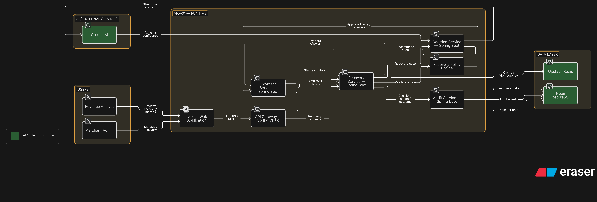

# ARX-01 — Autonomous Revenue eXcovery

> Autonomous, AI-guided payment recovery engine with deterministic policy guardrails and immutable audit trails for recurring billing.

[](https://openjdk.org/)
[](https://spring.io/projects/spring-boot)
[](https://spring.io/projects/spring-cloud-gateway)
[](https://nextjs.org/)
[](https://www.typescriptlang.org/)
[](https://tailwindcss.com/)
[](https://neon.tech/)
[](https://groq.com/)

---

## Overview

Subscription and recurring payment failures cause involuntary merchant churn due to static, uncoordinated retry schedules. 

**ARX-01** automates payment recovery end-to-end:
1. Ingests payment failure telemetry in real time.
2. Synthesizes recovery strategies via Groq LLM inference (`llama-3.3-70b-versatile`).
3. Enforces safety limits through a deterministic policy guardrail engine.
4. Executes smart retries and records complete lifecycle transitions in an immutable audit ledger.

*Note: In this prototype, payment failures and retries are simulated in software. Direct Razorpay live gateway and webhook integration is a future production integration point.*

---

## Recovery Flow

```text
[ Failed Payment ]
       │
       ▼
[ AI Recommendation (Groq) ]
       │
       ▼
[ Policy Guardrail Engine ] ──(Blocked)──> [ Recovery Exhausted ]
       │ (Allowed)
       ▼
[ Smart Retry Execution ]
       │
       ▼
[ Revenue Recovered ] ──> [ Audit Trail (PostgreSQL) ]
```

---

## Architecture



### Microservices

| Service | Port | Responsibility |
| --- | --- | --- |
| **API Gateway** | `8080` | Spring Cloud Gateway reverse proxy routing client requests |
| **Recovery Service** | `8081` | Recovery case lifecycle, state machine, and deterministic policy engine |
| **Decision Service** | `8082` | AI decisioning engine querying Groq Cloud LLM for strategy recommendations |
| **Payment Service** | `8083` | Payment records, failure simulation, Flyway migrations, and retry execution |
| **Audit Service** | `8084` | Append-only event store with foreign-key referential integrity to recovery cases |
| **Frontend Console** | `3000` | Terminal-style operations dashboard built with Next.js & Tailwind CSS |

---

## Local Setup

### 1. Environment Variables

```bash
export DATABASE_URL="jdbc:postgresql://<host>/<database>?sslmode=require"
export DATABASE_USERNAME="<username>"
export DATABASE_PASSWORD="<password>"
export GROQ_API_KEY="<your-groq-api-key>"
```

### 2. Run Backend Services

In separate terminal sessions:

```bash
# Payment Service (Port 8083) - runs Flyway migrations automatically
cd services/payment-service && ./mvnw spring-boot:run

# Audit Service (Port 8084)
cd services/audit-service && ./mvnw spring-boot:run

# Decision Service (Port 8082)
cd services/decision-service && ./mvnw spring-boot:run

# Recovery Service (Port 8081)
cd services/recovery-service && ./mvnw spring-boot:run

# API Gateway (Port 8080)
cd services/api-gateway && ./mvnw spring-boot:run
```

### 3. Run Frontend Dashboard

```bash
cd client
npm install
npm run dev
```

Open `http://localhost:3000` in your browser.

---

## Demo Walkthrough

1. **Simulate Failure**: Click `[ + SIMULATE FAILURE ]` in the top header to generate an INR (`₹`) payment failure.
2. **AI Decision**: Groq AI analyzes transaction telemetry and outputs the recommended action (`SMART_RETRY`), risk score, confidence, and reasoning.
3. **Policy Verification**: The deterministic Policy Engine verifies safety rules (`MAX_ATTEMPTS = 3`, positive balance, non-terminal state).
4. **Execute Recovery**: Click `[ EXECUTE RECOVERY ]` on the open case to trigger the smart retry and mark revenue as recovered.
5. **Audit Inspection**: Review the chronological ledger: `RECOVERY_CREATED` → `AI_RECOMMENDATION` → `ACTION_EXECUTED` → `PAYMENT_RECOVERED`.

---

## Context

- **Event**: Razorpay AI Buildathon
- **Track**: Track 03 — AI Revenue Recovery
- **Project**: ARX-01 (Autonomous Revenue eXcovery)
